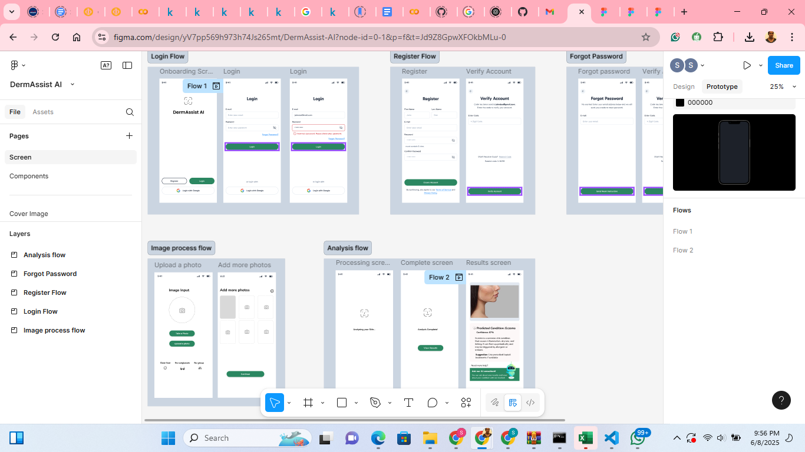

# derma_assist_project

DermAssist AI – Skin Disease Detection & Education

Project Description
DermAssist AI is a real-time skin disease detection and educational assistant. The application uses deep learning and computer vision to classify skin disease images into 10 common categories and provides basic, user-friendly information about each detected condition. The goal is to support fast, accessible screening and education, especially in resource-limited settings.

Links

GitHub repository: [https://github.com/StellaIbeh/derma_assist_project]

Demo video: [VideoLink]

Figma designs: [https://www.figma.com/design/yV7pp569h973h74Js265mt/DermAssist-AI?node-id=0-1&t=Jd9Z8GpwXFOkbMLu-1]

How to Set Up the Environment and Run the Project
Clone the repository:

bash
Copy
Edit
git clone [https://github.com/StellaIbeh/derma_assist_project]
cd repo-folder
Create a virtual environment & install requirements:

bash
Copy
Edit
python -m venv venv
source venv/bin/activate  # On Windows: venv\Scripts\activate
pip install -r requirements.txt
(For notebooks)
Open and run the main Jupyter/Colab notebook:

Copy
Edit
ModelNotebook.ipynb
(For API/app deployment, if available):

bash
Copy
Edit
# streamlit
streamlit run app.py
Dataset:

Download the dataset from Kaggle:
https://www.kaggle.com/datasets/muhammadabdulsami/massive-skin-disease-balanced-dataset

Place the unzipped files in the data/ directory.

Designs
Figma mockups:
[]

Deployment Plan
Model hosting: Model can be served via a lightweight Flask or FastAPI backend or exported to TensorFlow Lite for mobile/web deployment.

Frontend: Designed for both web (React) and mobile (Figma mockups).

API: REST endpoint for predictions, Swagger/Postman tested.

Next steps: Optionally integrate to a full app or deploy demo on [Heroku/Render/Streamlit Cloud] for public testing.

Video Demo
Click here to watch the full demo.

Duration: ~5 minutes

Focus: Step-by-step demonstration of image upload, prediction, and user experience

Note: The video avoids deep technical research description and is focused on the app's practical functionalities.

File Structure
bash
Copy
Edit
├── data/                  # Data files (images)
├── notebooks/             # Jupyter/Colab notebooks
├── src/                   # Source code
├── app.py                 # (If web/API app)
├── requirements.txt
├── README.md
└── screenshots/           # App screenshots for the README
Note: This project is continually updated. Please check the GitHub repo for the latest features, bug fixes, and updates.
